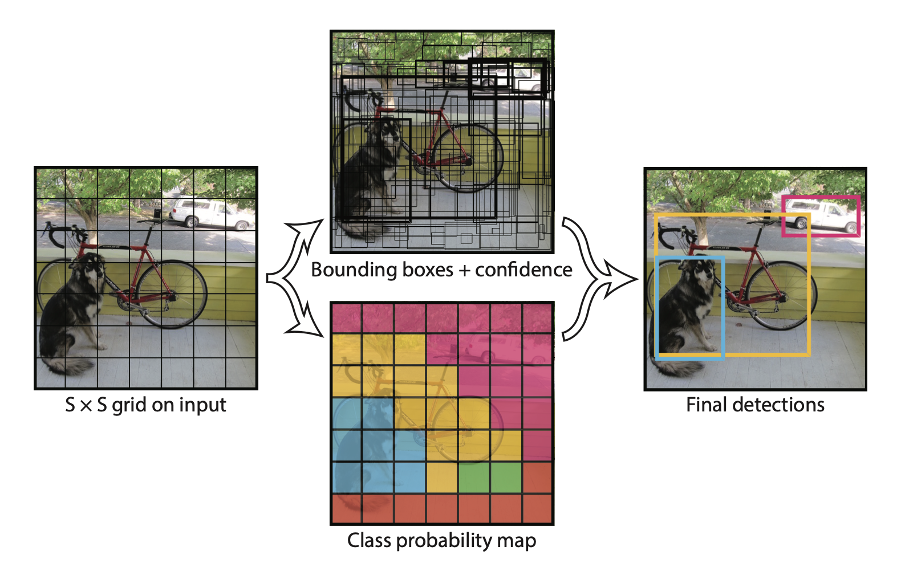
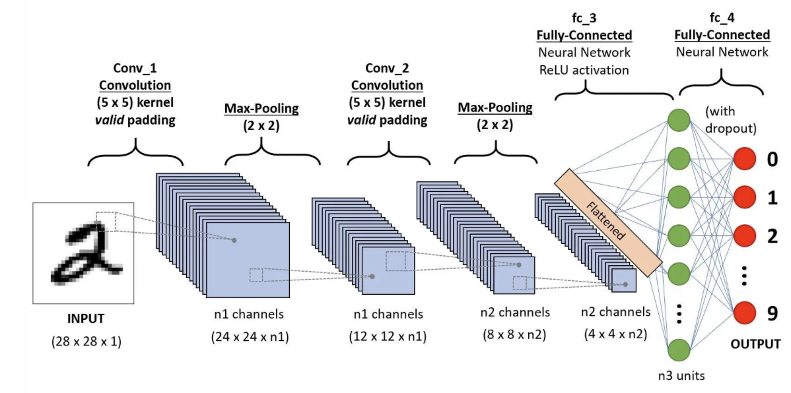
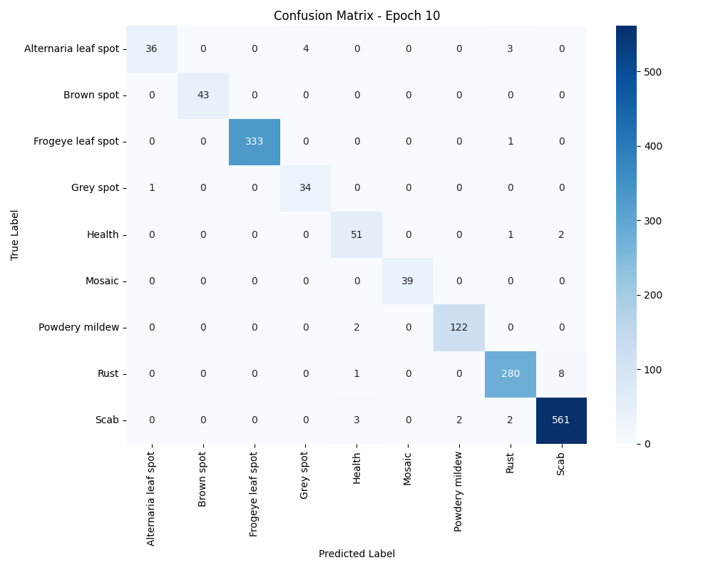
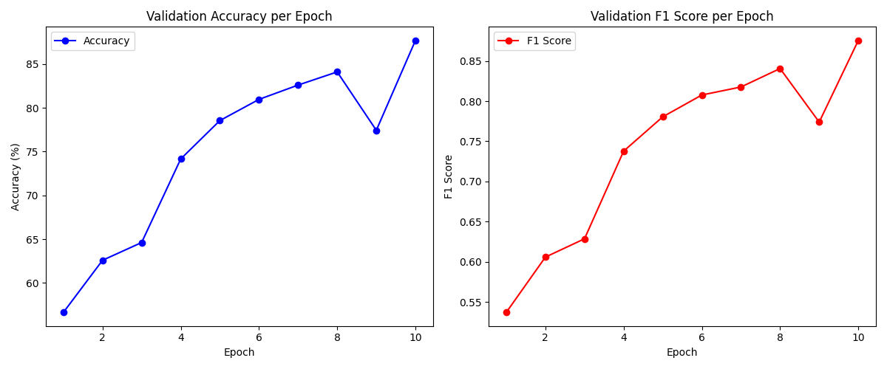

# Training and Deployment of Computer Vision Deep Learning Models

## Table of Contents

1. [Useful Guidebooks](#1-useful-guidebooks)

2. [Trending Communities](#2-trending-communities)

3. [Relevant Data Sources](#3-relevant-data-sources)

4. [Possible Model Framework](#4-possible-model-framework)

5. [Model Workflow](#5-model-workflow)

6. [Environment Setup](#6-environment-setup)

7. [Model Training](#7-model-training)

8. [Getting Started Guide](#8-getting-started-guide)

   [References](#9-references)

## 1. Useful Guidebooks
**D2L.ai**: An interactive deep learning book that integrates multiple frameworks, mathematical explanations, and discussions. It's highly suitable for both beginners and advanced practitioners.

[https://github.com/d2l-ai/d2l-en](https://github.com/d2l-ai/d2l-en)

---

## 2. Trending Communities
- **Hugging Face: AI community**  
  It Offers various model frameworks and diverse datasets. **Highly recommended.** [Hugging Face AI Community](https://huggingface.co/)
- **Kaggle**  
  A data science platform providing online computation resources for training large models. It offers the first 30 hours of computing power for free, with pre-configured environments for easy deployment. [Kaggle](https://www.kaggle.com/)

---

## 3. Relevant Data Sources
- **Flower Net**  
  A dataset containing images of healthy and diseased rose leaves with corresponding labels. 
  
  [Flower Net Dataset](https://data.mendeley.com/datasets/7z67nyc57w/2) 
  
- **Plant Village**  
   A dataset comprising 54,303 images of healthy and diseased leaves categorized into 38 classes by species and diseases.  
  
  [Plant Village](https://www.tensorflow.org/datasets/catalog/plant_village) 

---

## 4. Possible Model Framework
A YOLO + CNN network can be used to build a large-scale visual diagnosis platform for real-time applications.

### a) IDEA

- **YOLO**: You Only Look Once (YOLO) is used to label and segment key objects, passing the segmented regions to a pre-trained CNN network. 
  (e.g., YOLO can label objects in real-time images, such as segmenting flower or plant regions)
  
  
  
  
  
  Source: https://arxiv.org/pdf/1506.02640
  
- **CNN**: The Convolutional Neural Network (CNN) is designed, trained, and fine-tuned specifically for tasks like plant disease diagnosis to achieve high-accuracy predictions. After detection, crop the identified regions and pass them to a CNN for detailed classification. 

  

  Source: https://saturncloud.io/blog/a-comprehensive-guide-to-convolutional-neural-networks-the-eli5-way/

### b) Recommended Networks
- **YOLO**: The latest version is YOLO v11. For robustness, we can deploy YOLO v10(preprint available on arXiv. Below is a link to its guidance.)
  **YOLOv10 Tutorial**: [https://docs.ultralytics.com/zh/models/yolov10/#comparisons](https://docs.ultralytics.com/zh/models/yolov10/#comparisons)
  
- **CNN**:  
  
  - ResNet (Residual Neural Network)  
  
    In ResNets, unlike in traditional neural networks, each layer feeds into the next layer, we use a network with residual blocks, each layer feeds into the next layer and directly into the layers about 2–3 hops away, to avoid over-fitting (a situation when validation loss stop decreasing at a point and then keeps increasing while training loss still decreases). This also helps in preventing [vanishing gradient problem](https://towardsdatascience.com/the-vanishing-gradient-problem-69bf08b15484) and allow us to train deep neural networks. Here is a simple residual block:
  
    
  
  - **VGG  (Visual Geometry Group Network)**  
    VGG is renowned for its deep architecture, utilizing small (3x3) convolutional filters to build networks with up to 19 layers, such as VGG16 and VGG19. These models are widely adopted for transfer learning due to their strong feature extraction capabilities. [VGG Paper](https://arxiv.org/abs/1409.1556)
    

---

## 5. Model Workflow
1. Use a mobile device to capture an image and upload it to the YOLO network.

2. YOLO identifies the type and location of objects requiring specific diagnosis.

3. If the object type matches the target (e.g., type == ‘flower’), preprocess the segmented region by enhancing, cropping, recoloring, and normalizing it to a uniform size before passing it to the CNN model.

4. The CNN model calculates the probabilities for various classes, and the class with the highest probability represents the diagnosed plant disease.


---

## 6. Environment Setup

### a) Local Setup

1. **Install necessary Python packages**：

   ```bash
   pip install numpy pandas matplotlib seaborn opencv-python Pillow
   pip install torch torchvision torchaudio
   pip install PIL
   ...
   # install other packages if needed
   ```

2. **Enable hardware acceleration**：

   - For Windows: Install *CUDA* ([https://developer.nvidia.com/cuda-downloads](https://developer.nvidia.com/cuda-downloads))  
   - For MacOS: Use *Metal Performance Shaders (MPS)* for hardware acceleration.
   - Alternatively, computations can be run on the CPU, though less efficient.

### b) Cloud Setup

- **Kaggle**:  
  - Pre-installed packages make environment setup easily.  
  - The remaining steps are identical to the local setup.
- **Other Cloud Services**
  - Huawei Cloud
  - Ali Cloud
  - Oracle
  - Environment needs to be installed manually

## 7. Model Training

### a) Data Preprocessing

1. Uniformly resize all images to a consistent dimension (e.g., 224x224 pixels) to maintain input consistency.
2. Apply random transformations such as horizontal flipping, rotation, and color jittering to enhance dataset diversity and improve model robustness.
3. Normalization: Scale pixel values to a standard range (e.g., [0,1] or normalized using dataset-specific means and standard deviations) to stabilize training and accelerate convergence.

### b) Model Training

1. Target is to optimize the performance  by setting up appropriate loss function.

   

   (https://medium.com/@abhishekjainindore24/a-comprehensive-guide-to-performance-metrics-in-machine-learning-4ae5bd8208ce)

   The four criterias for model performance are precision, recall, accuracy and F-score.
   $$
   Precision=\frac{TP}{TP+FP}
   $$

   $$
   Recall=\frac{TP}{TP+FN}
   $$

   $$
   Accuracy=\frac{TP+TN}{TP+FP+FN+TN}
   $$

   $$
   F_\beta=(1+\beta^2)\frac{Precision*Recall}{(\beta^2*Precision)+Recall}
   $$

   

2. Loss function: Choose an appropriate loss function based on the classification task. For multi-class classification, Cross-Entropy Loss is commonly used.
   $$
   \text{Cross Entropy Loss: }\mathcal{L} = -\frac{1}{N} \sum_{i=1}^{N} \sum_{c=1}^{C} y_{i,c} \log(\hat{y}_{i,c})
   $$ {Cross Entropy Loss}
   
3. Optimizer:

   1. *Adam*: Adaptive Moment Estimation optimizer that adjusts learning rates on a per-parameter basis, suitable for most deep learning tasks.
   2. *SGD* (Stochastic Gradient Descent): A traditional optimizer that can be effective with appropriate learning rate schedules and momentum.
   3. *RM Sprop*: An optimizer that maintains a moving average of squared gradients, suitable for non-stationary objectives.

   Currently, *Adam* and *SGD* are most commonly used for CNN training. SGD is the primary choice as it adjusts learning rate automatically. Nevertheless, it depends on the situation, not all *Adam*'s effect better than *SGD*'s.

### c) Train CNN on cloud or local platforms

- **Training Resources**：  
  
  - Local training is slow and burdensome on PCs. Cloud-based training is recommended.
  - Local training can use NVIDIA’s CUDA for GPU acceleration (requires NVIDIA GPUs). Mac users can use MPS.
- **GPU vs CPU**:  
  
  ​	•	GPUs are suited for large-scale, simple calculations (e.g. Thousands of plus/subtract/multiply/devides equations computed by thousands of primary school students ).
  
  ​	•	CPUs handle smaller, more complex computations (e.g. One mathematician solve differential manifolds).
  
  ​	•	**GPUs** are more efficient for large-scale **matrix operations** typically required for model training.

###  Deploy the trained model locally

Deploy the trained model locally to perform accurate diagnostics of plant health conditions in images. The forecast require relatively low computational resources thus can run without GPU acceleration.

## 8. Quick Starting Guide

A python project is attached with this document, which can be served as a sample for learning and practice.

### a) Prerequisites

1. anaconda 23.5.2 [Download Here](https://www.anaconda.com/products/distribution)
2. python 3.9 [Download Here](https://www.python.org/downloads/release/python-390/)
3. IDE: VS Code/PyCharm recommended 

### b) Installation Steps

1. Clone the repository

   Open the terminal and execute the following commands:

   ```sh
   cd ~/path/to/store/project # Replace with your desired project directory
   git clone https://github.com/GryphonJade/Flower_DL_Demo.git
   ```

2. Install the environment

   ```sh
   conda env create -f environment.yml
   conda activate flower_detect
   ```

3. Edit the configuration

   `config.yaml` is located at the main dicretory of the example project. It determines the mode of operation of the model and can be set as needed.

   **Example Training Configuration **：

   ```yaml
   # config.yaml
   # This configuration file defines the settings for training and deploying computer vision deep learning models.
   # It includes configurations for data sources, model architectures, training parameters, and prediction settings.
   
   
   mode: train  # Specifies the operation mode of the project. Options: 'train' or 'predict'.
   
   
   data_source:
     type: local  # Type of data source. Options: 'local' or 'online'.
     package: some-ai-community-dataset  # (Only relevant if type is 'online') The name of the dataset package to install.
     dataset_name: flower_dataset  # (Only relevant if type is 'online') The name of the dataset to use.
     download: false  # (Only relevant if type is 'online') Whether to download the dataset automatically.
   
   
   detector:
     model_name: yolov10n  # The name of the YOLO model variant to use. Example: 'yolov10n'.
     pretrained: true  # Indicates whether to use pretrained weights for the detector.
     model_path: models/yolov10/yolov10n.pt  # Path to the YOLO model weights file.
     expected_type_id: '80'  # (Optional) The class ID expected by the detector, based on the dataset's label mapping (e.g., COCO dataset).
   
   
   classifier:
     model_type: custom  # Type of classifier model. Options: 'torchvision' for standard torchvision models or 'custom' for user-defined models.
     model_module: models.custom.custom_model  # Python module path where the custom model class is defined. Must follow Python import conventions.
     model_name: ResNet9  # Name of the model class to instantiate from the specified module.
     class_name: ResNet9  # (Redundant with model_name; can be used interchangeably) Name of the classifier class.
     model_path: models/ResNet9/classifier.pth  # Path to the classifier model weights file.
     pretrained: true  # Indicates whether to use pretrained weights for the classifier.
     class_mapping_path: models/ResNet9/class_mapping.json  # Path to the JSON file that maps class names to indices.
   
   
   training:
     data_dir: data  # Base directory where training data is stored.
     temp_dir: data/temp  # Temporary directory for processing data splits (e.g., train/val/test).
     batch_size: 32  # Number of samples per batch during training.
     num_epochs: 10  # Total number of training epochs.
     optimizer:
       type: SGD  # Type of optimizer to use. Options: 'SGD', 'Adam', 'RMSprop', etc.
       lr: 0.01  # Learning rate for the optimizer.
       weight_decay: 0  # Weight decay (L2 regularization) parameter.
       momentum: 0.9  # Momentum parameter for SGD and RMSprop optimizers.
     device: mps  # Hardware accelerator to use. Options: 'cpu', 'cuda' (NVIDIA GPU), 'mps' (Apple Metal Performance Shaders).
     is_detector: 'false'  # Indicates whether to use the detector during training. Options: 'true' or 'false'.
     confusion_path: training/ResNet9/confusion_matrices.json  # Path to save confusion matrices generated during training.
     metrics_path: training/ResNet9/metrics.json  # Path to save performance metrics (accuracy, F1 score) generated during training.
     confusion_output_dir: visualizations/ResNet9/confusion_matrices  # Directory to save visual representations of confusion matrices.
     metrics_output_dir: visualizations/ResNet9/metrics  # Directory to save visual representations of performance metrics.
     save_path: models/ResNet9/classifier.pth  # Path to save the latest classifier model weights after each epoch.
     best_model_path: models/ResNet9/f1best.pth  # Path to save the best classifier model weights based on F1 score.
   
   ## Prediction Configuration
   prediction:
     predict_dir: data/train/Scab  # Directory containing images to run predictions on.
     output_dir: predict/results  # Directory to save prediction results (e.g., CSV files, annotated images).
     device: mps  # Hardware accelerator to use for predictions. Options: 'cpu', 'cuda', 'mps'.
     is_detector: 'false'  # Indicates whether to use the detector during prediction. Options: 'true' or 'false'.
   ```

   - `Config`: Defines hyperparameters, such as `epoch`、`batch size`、`learning rate` etc..

     - `batch_size` is the total number of images given as input at once in forward propagation of the CNN. Basically, batch size defines the number of samples that will be propagated through the network.

     - `epoch` is the total number of rounds of model training, that is, the number of times that all training data passes through the network. **Commonly, we set it between 10 and 100 for most tasks.**

     - `learning rate` represents the speed of optimization. The learning rate determines the magnitude of each gradient descent.

     - `momentum` determines the contribution of the previous velocity to the current update. A higher momentum means that more past gradients influence the current update. Typically, set it between 0.5-0.99

       $$
       v_{t+1} = \gamma \cdot v_t + \eta \cdot \nabla_{\theta} J(\theta_t)\\
       
       \theta_{t+1} = \theta_t - v_{t+1}
       $$
       **Where:**
       
       - $\mu$ : Learning rate
       - $\gamma$: Momentum coefficient
       -  $\theta_t$: Parameters at iteration t 

4. Download the data

   The pretrained model is based on a dataset of apple diseases, which is attached to this document. First download the data, then put the data file in the root path of the project as below:

   ```
   Flower_DL_Demo/
   ├── configs/
   │   └── config.yaml ...
   ├── data/
   │   ├── train/
   │   │   ├── Alternaria leaf spot/
   │   │   ├── Brown spot/
   │   │   ├── Frogeye leaf spot/
   │   │   ├── Grey spot/
   │   │   ├── Health/
   │   │   ├── Mosaic/
   │   │   ├── Powdery mildew/
   │   │   ├── Rust/
   │   │   └── Scab/
   │   ├── test/
   │   ├── temp/
   ...
   ```

5. Run the code

   ```shell
   python auto_update
   python main.py
   ```

​	Run the above Python files to train or predict. Then, run the following Python file to visualize the training 	process and confusion matrix. 

```shell
python visualize_confusion.py
```





### c) Other Detailed Information & tips

1. DataLoader

   - The **`DataLoader`** class in PyTorch is responsible for loading the dataset and preparing it for training or evaluation. One important parameter in `DataLoader` is `num_workers`, which specifies the number of subprocesses to use for data loading.

   - **`num_workers`**: Determines how many subprocesses are used to load the data in parallel. A higher number can speed up data loading, especially with large datasets. However, setting `num_workers=1` can help resolve issues related to multiprocessing, particularly on Windows or MacOS systems where multiprocessing can sometimes cause errors.

     - **Recommendation**: If you encounter problems such as slow data loading or errors during data fetching, try setting `num_workers=1` or eliminate `num_workers`option.

       ```python
       train_loader = DataLoader(train_dataset, batch_size=batch_size, shuffle=True, num_workers=1)
       val_loader = DataLoader(val_dataset, batch_size=batch_size, shuffle=False, num_workers=1)
       ```

2. Auto class mapping

   The project automatically handles class mapping by associating each class label with a unique index based on the directory structure of the training data. This ensures consistency between training and prediction phases.

   - Class Mapping Process:
     - During training, the script scans the training directory, identifies all class subdirectories, and assigns each class a unique index.
     - This mapping is saved in a JSON file (class_mapping.json) within the model’s directory.
     - During prediction, the script loads this mapping to interpret the model’s output indices back to class names.

3. Prediction Workflow:

   If is_detector is set to 'true', ensure that the detector model is properly integrated with the classifier. The detection results should be correctly passed to the classifier for subsequent classification.

## References

1. Wang, Ao, et al. "YOLOv10: Real-Time End-to-End Object Detection." *arXiv preprint arXiv:2405.14458* (2024). 
   [arXiv:2405.14458](https://arxiv.org/abs/2405.14458)

2. Redmon, Divvala, et al. "You Only Look Once: Unified, Real-Time Object Detection." *arXiv preprint arXiv:1506.02640* (2015).[arXiv:1506.02640](https://arxiv.org/abs/1506.02640v5) 

3. He, Kaiming, et al. "Deep residual learning for image recognition." *Proceedings of the IEEE conference on computer vision and pattern recognition*, pp. 770-778 (2016).  https://openaccess.thecvf.com/content_cvpr_2016/html/He_Deep_Residual_Learning_CVPR_2016_paper.html

4. Hugging Face. "Hugging Face AI Community."  https://huggingface.co/

5. Kaggle. "Kaggle Data Science Platform."  https://www.kaggle.com/

6. PlantVillage. "PlantVillage Dataset."  
   [TensorFlow PlantVillage](https://www.tensorflow.org/datasets/catalog/plant_village)

7. FlowerNet. "FlowerNet (Rose Disease)."  
   https://data.mendeley.com/datasets/7z67nyc57w/2

   

